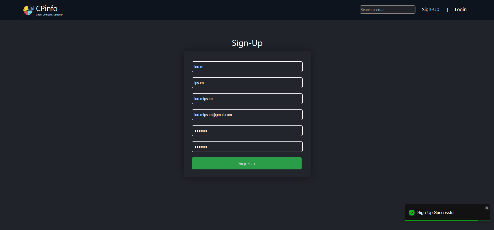
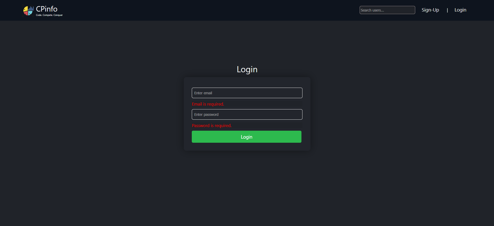
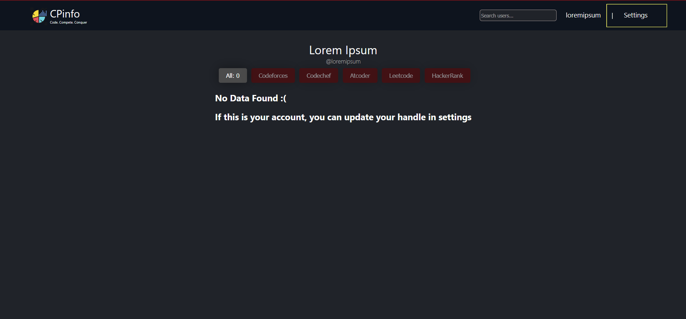
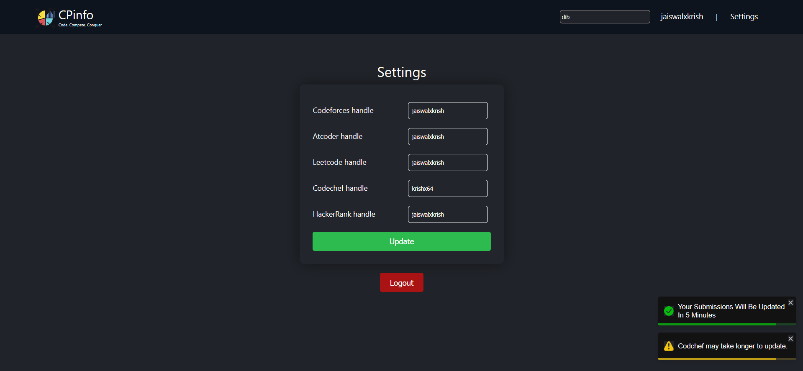
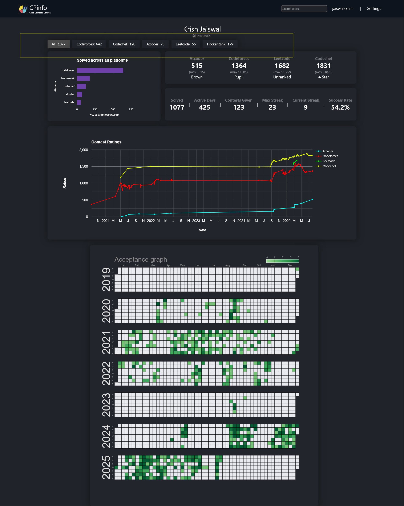
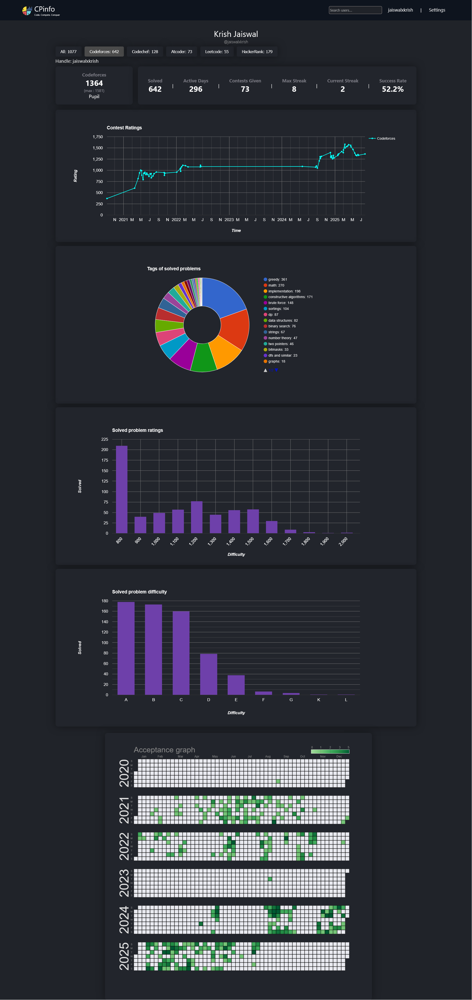
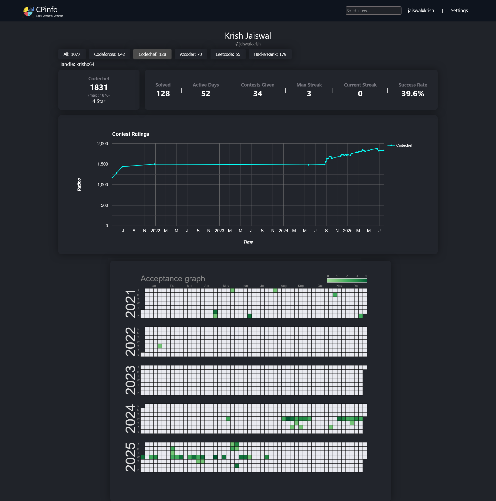
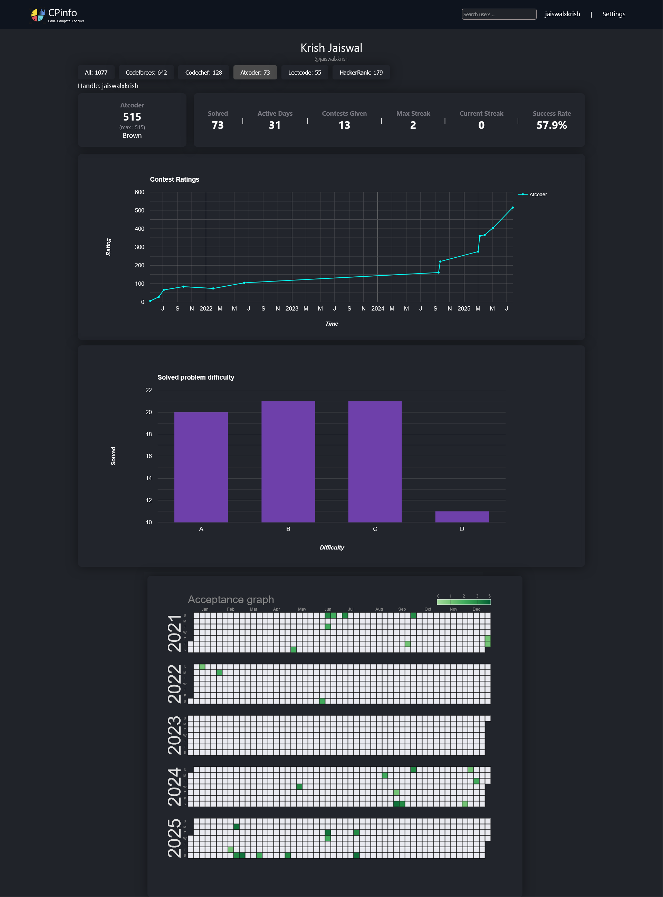
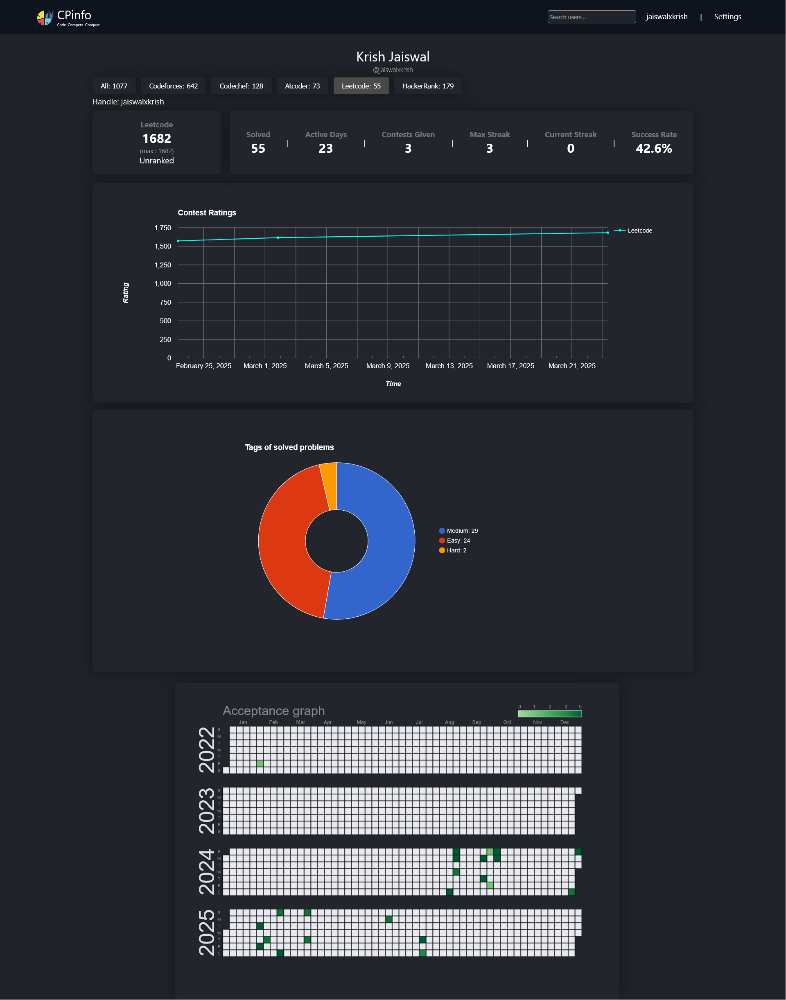
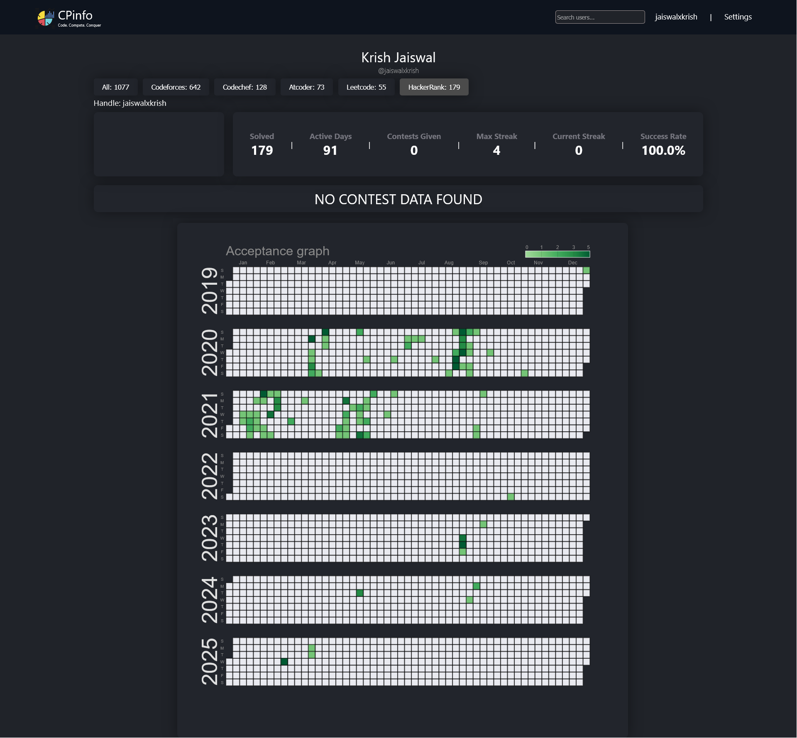

CPinfo is a full-stack web application designed to aggregate and visualize competitive programming profiles from platforms like Codeforces,CodeChef,LeetCode,HaackerRank and Atcoder. It enables users to input a username and fetch their latest contest statistics, problem-solving history, and rating progression.

The backend is built with Node.js and Express, featuring secure JWT-based authentication with refresh token handling via HTTP-only cookies. User data is stored in MongoDB, and Redis caching is used to reduce API latency and improve performance.

The project is live on: https://cpinfo-s6xv.onrender.com/

My profile as an example: https://cpinfo-s6xv.onrender.com/user/jaiswalxkrish

# How to get started

Open the site with the link:- https://cpinfo-s6xv.onrender.com/

You will be greeted with a login page, if you haven't signed up yet click on the sign up page from top right menu corner (image attached below for reference)

Fill in your details and click Sign-up, and you are done!

Then go to the login page and login with you credentials.

After successfully logging in, your profile will be empty because your handles from various platforms have not been added yet, you can add them from the settings tab (image attached below for reference)

You can give handles for whichever platform you use and click update so the changes are saved, once saved you won't have to type them again(you can also change them anytime). For everytime you want to update your profile and fetch statistics from all the platform go to settings and click on update. Once the confirmation alert is recieved in bottom right you can go back to your profile from the top menu and wait a minute to refresh and your stats will be there.

Note:- Codechef might take time (excessive time in some cases) due to their API's being rate limited. If you have excessive submission it might take 30 mins - 1hr depending on the total number of your submissions. But once done for the first time every other time it will be very quick! So it's just a one time thing.

After everything is updated your profile will look something like this (taking my profile as an example)

You can also see platform specific statistics, the menu featuring all the platform names and solved count is clickable and you can view various statistics to understand and track progress on each platform better(image attached below for reference).

That is all!

# Getting Started with Create React App

This project was bootstrapped with [Create React App](https://github.com/facebook/create-react-app).

## Available Scripts

In the project directory, you can run:

### `npm start`

Runs the app in the development mode.\
Open [http://localhost:3000](http://localhost:3000) to view it in your browser.

The page will reload when you make changes.\
You may also see any lint errors in the console.

### `npm test`

Launches the test runner in the interactive watch mode.\
See the section about [running tests](https://facebook.github.io/create-react-app/docs/running-tests) for more information.

### `npm run build`

Builds the app for production to the `build` folder.\
It correctly bundles React in production mode and optimizes the build for the best performance.

The build is minified and the filenames include the hashes.\
Your app is ready to be deployed!

See the section about [deployment](https://facebook.github.io/create-react-app/docs/deployment) for more information.

### `npm run eject`

**Note: this is a one-way operation. Once you `eject`, you can't go back!**

If you aren't satisfied with the build tool and configuration choices, you can `eject` at any time. This command will remove the single build dependency from your project.

Instead, it will copy all the configuration files and the transitive dependencies (webpack, Babel, ESLint, etc) right into your project so you have full control over them. All of the commands except `eject` will still work, but they will point to the copied scripts so you can tweak them. At this point you're on your own.

You don't have to ever use `eject`. The curated feature set is suitable for small and middle deployments, and you shouldn't feel obligated to use this feature. However we understand that this tool wouldn't be useful if you couldn't customize it when you are ready for it.

## Learn More

You can learn more in the [Create React App documentation](https://facebook.github.io/create-react-app/docs/getting-started).

To learn React, check out the [React documentation](https://reactjs.org/).

### Code Splitting

This section has moved here: [https://facebook.github.io/create-react-app/docs/code-splitting](https://facebook.github.io/create-react-app/docs/code-splitting)

### Analyzing the Bundle Size

This section has moved here: [https://facebook.github.io/create-react-app/docs/analyzing-the-bundle-size](https://facebook.github.io/create-react-app/docs/analyzing-the-bundle-size)

### Making a Progressive Web App

This section has moved here: [https://facebook.github.io/create-react-app/docs/making-a-progressive-web-app](https://facebook.github.io/create-react-app/docs/making-a-progressive-web-app)

### Advanced Configuration

This section has moved here: [https://facebook.github.io/create-react-app/docs/advanced-configuration](https://facebook.github.io/create-react-app/docs/advanced-configuration)

### Deployment

This section has moved here: [https://facebook.github.io/create-react-app/docs/deployment](https://facebook.github.io/create-react-app/docs/deployment)

### `npm run build` fails to minify

This section has moved here: [https://facebook.github.io/create-react-app/docs/troubleshooting#npm-run-build-fails-to-minify](https://facebook.github.io/create-react-app/docs/troubleshooting#npm-run-build-fails-to-minify)
